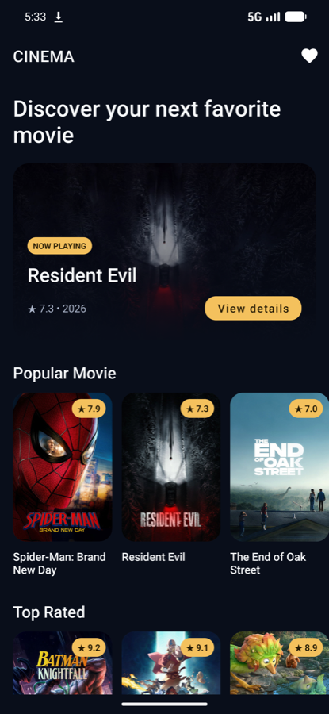
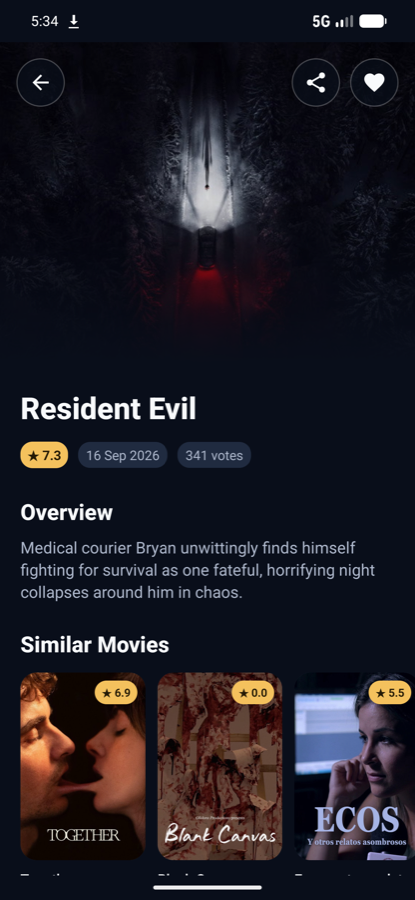
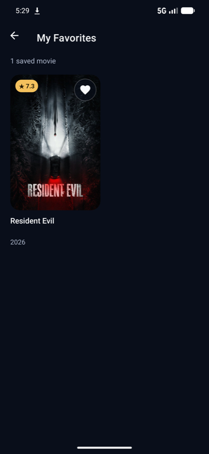
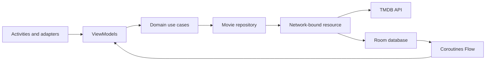

<div align="center">

# Cinema App

### A polished Android movie discovery experience built with Kotlin and Clean Architecture

[](https://github.com/fhmsyhd/Cinema-App/actions/workflows/android-ci.yml)


Cinema App explores now-playing, popular, and top-rated movies from TMDB. It was built as a portfolio project to demonstrate production-minded Android development: modular boundaries, reactive data flows, local persistence, resilient UI states, dependency injection, and automated verification.

</div>

## App preview

<p align="center">
  
  &nbsp;
  
  &nbsp;
  
</p>

## Highlights

- Discover **now-playing, popular, and top-rated** movies in a focused home experience.
- Explore movie metadata, ratings, overviews, reviews, and related titles.
- Save favorites locally and manage them in a two-column library with sorting and undo removal.
- Keep cached movie data visible when a refresh fails, with dedicated loading, empty, error, and retry states.
- Share a movie directly from its detail screen.
- Load images efficiently with placeholders, error fallbacks, and cross-fade transitions.

## Architecture

The project separates presentation concerns from domain operations and data-source implementations. The UI communicates with focused use cases through ViewModels, while the repository coordinates remote TMDB responses and Room persistence.



```text
Cinema-App
├── app                         # Presentation layer
│   ├── adapter                 # Home, detail, review, and favorite lists
│   ├── utils                   # UI state models
│   └── view                    # Activities and ViewModels
└── core
    └── data
        ├── data
        │   ├── source/local    # Room database and DAO
        │   └── source/remote   # Retrofit API and response models
        ├── domain
        │   ├── model           # UI-independent domain models
        │   ├── repository      # Repository contract
        │   └── usecase         # Focused application operations
        └── di                  # Hilt dependency graph
```

### Key engineering decisions

- **Cache-aware data flow:** movie feeds are exposed as `Flow` values backed by Room, so cached content can remain useful during loading or network failure.
- **Explicit mapping boundaries:** API responses and database entities are converted into domain models instead of leaking infrastructure types into the UI.
- **Small use cases:** each screen depends on focused operations such as loading popular movies or updating a favorite.
- **Purpose-built list adapters:** the favorite library uses its own adapter and interaction model instead of adding screen-specific branching to the home adapter.
- **Local configuration:** the TMDB key is read from an environment variable or untracked `local.properties`, then exposed to the data module through `BuildConfig`.

## Tech stack

| Area | Technology |
| --- | --- |
| Language | Kotlin 2.0 |
| UI | XML, Material Components, View Binding, RecyclerView |
| Architecture | Clean Architecture, MVVM, multi-module project |
| Reactive state | Kotlin Coroutines, Flow, LiveData |
| Dependency injection | Hilt and KSP |
| Networking | Retrofit, Gson converter |
| Persistence | Room |
| Image loading | Glide |
| Testing | JUnit, Mockito, Coroutines Test, AndroidX Core Testing |
| Automation | GitHub Actions, Android Lint, Gradle |

## Getting started

### Requirements

- Android Studio with JDK 17
- Android SDK 34
- A [TMDB API key](https://developer.themoviedb.org/docs/getting-started)

### Setup

1. Clone the repository.

   ```bash
   git clone https://github.com/fhmsyhd/Cinema-App.git
   cd Cinema-App
   ```

2. Open the project in Android Studio and allow it to create `local.properties`, or copy the provided example.

3. Add your SDK location and TMDB key to `local.properties`:

   ```properties
   sdk.dir=/path/to/Android/Sdk
   TMDB_API_KEY=your_tmdb_v3_api_key
   ```

4. Sync Gradle and run the `app` configuration on an emulator or Android device.

You can alternatively provide `TMDB_API_KEY` as an environment variable; it takes precedence over the value in `local.properties`.

> [!IMPORTANT]
> `local.properties` is excluded from version control. API keys embedded in mobile applications can still be extracted from a built APK, so use a restricted key and rotate it if it is ever exposed.

## Quality checks

Run the same verification used while developing the project:

```bash
./gradlew test lintDebug assembleDebug
```

The current suite contains unit tests for presentation state, domain use cases, and data mapping in both the `app` and `core:data` modules. GitHub Actions runs unit tests and Android lint for every push and pull request targeting `main`.

## Current scope

Cinema App is a demonstration project rather than a production TMDB client. It currently focuses on movie discovery and local favorites; features such as authentication, pagination, accessibility instrumentation tests, and Play Store distribution are outside its present scope.

## Data attribution

This product uses the TMDB API but is not endorsed or certified by TMDB. Movie metadata and images are provided by [The Movie Database](https://www.themoviedb.org/).

## Author

**Fahmi Imam Syuhada** — Android Developer

[LinkedIn](https://www.linkedin.com/in/fhmsyhd/) · [GitHub](https://github.com/fhmsyhd)
