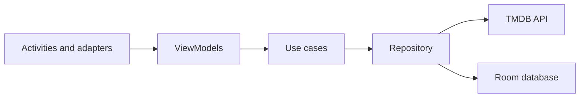

# Cinema App

[](https://github.com/fhmsyhd/Cinema-App/actions/workflows/android-ci.yml)

Cinema App is a modular Android application for discovering movies from The Movie Database (TMDB). It demonstrates Clean Architecture, MVVM, local persistence, reactive data flows, dependency injection, and automated testing in a maintainable multi-module project.

## Features

- Browse now-playing, popular, and top-rated movies.
- View movie details, user reviews, and similar titles.
- Save favorite movies for offline access.
- Handle loading, empty, and error states.

## Tech Stack

- **Language:** Kotlin
- **UI:** XML, View Binding, RecyclerView, Material Components
- **Architecture:** Clean Architecture and MVVM
- **Modularization:** `:app` and `:core:data`
- **Dependency injection:** Hilt
- **Networking:** Retrofit and OkHttp
- **Local storage:** Room
- **Asynchronous work:** Kotlin Coroutines and Flow
- **Image loading:** Glide
- **Testing:** JUnit, Mockito, Coroutines Test, and AndroidX Core Testing

## Architecture



```text
Cinema-App
├── app
│   ├── view
│   ├── adapter
│   └── ViewModels
└── core
    └── data
        ├── data
        │   ├── source/remote
        │   └── source/local
        ├── domain
        │   ├── model
        │   ├── repository
        │   └── usecase
        └── di
```

The UI depends on use cases rather than data-source implementations. The repository coordinates the TMDB API and Room database, while data mappers keep network, database, and domain models separate.

## Getting Started

### Requirements

- Android Studio with JDK 17
- Android SDK 34
- A TMDB API key

### Configuration

1. Clone the repository:

   ```bash
   git clone https://github.com/fhmsyhd/Cinema-App.git
   cd Cinema-App
   ```

2. Create `local.properties` in the project root, or use the file generated by Android Studio.

3. Add your Android SDK path and TMDB API key:

   ```properties
   sdk.dir=/path/to/Android/Sdk
   TMDB_API_KEY=your_tmdb_api_key
   ```

4. Sync Gradle and run the `app` configuration.

`local.properties` is ignored by Git. You may also provide the key through the `TMDB_API_KEY` environment variable, which takes precedence over the local value.

## Verification

Run the unit-test suite:

```bash
./gradlew test
```

Run Android lint:

```bash
./gradlew lintDebug
```

GitHub Actions runs both checks for pushes and pull requests targeting `main`.

## Data and Attribution

This product uses the TMDB API but is not endorsed or certified by TMDB. Movie metadata and images are provided by [The Movie Database](https://www.themoviedb.org/).
